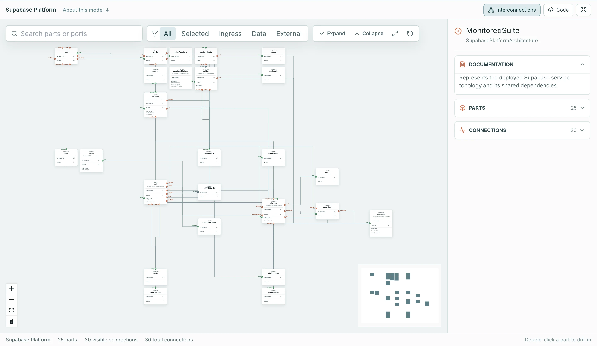
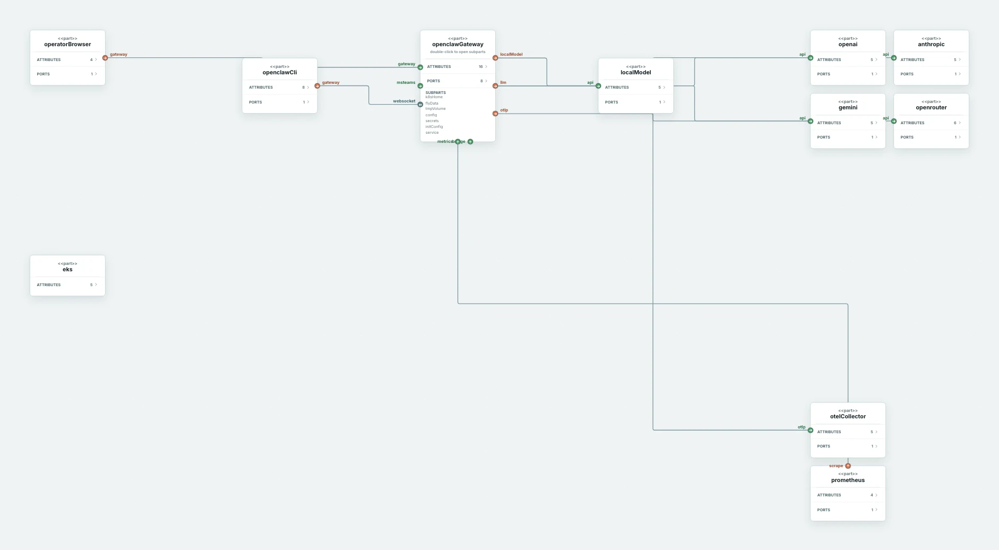
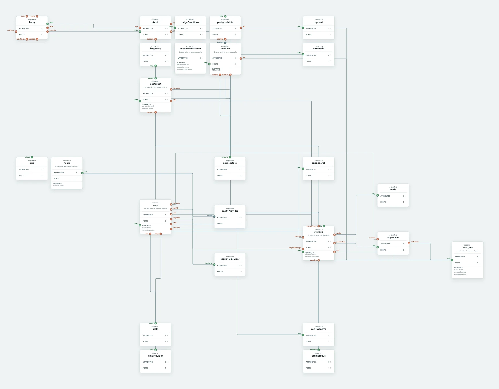
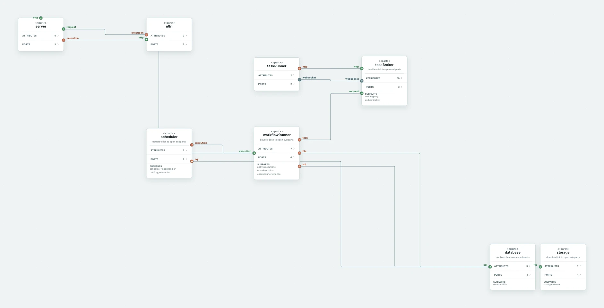
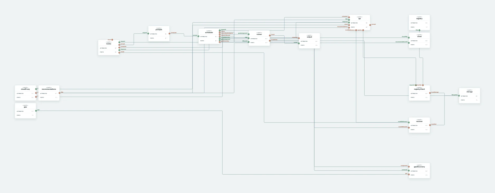

<div align="center">

# SysML Repo Modeler



**Turn one GitHub repository—or many—into an explorable SysML v2 system model.**

A self-hosted AI analysis harness reads the source, traces components and
connections across repositories, validates the model, and produces both SysML v2
code and an interactive architecture graph.

[](LICENSE)


[](CONTRIBUTING.md)

[How It Works](#how-it-works) · [Live Models](#live-models) · [Quick Start](#quick-start) · [Configuration](#configuration) · [Local Development](#local-development) · [Contributing](#contributing)

<br />

</div>

# About SysML Repo Modeler

Modern software systems rarely live in a single repository. Architecture is
spread across many services, libraries, and teams, and the connections between
them are easy to lose track of — leaving the true shape of a system documented
only in people's heads. Keeping an accurate, shared picture of how everything
fits together is one of the hardest parts of working on large systems.

SysML Repo Modeler makes that picture explicit. Its AI analysis harness uses
[OpenCode](https://opencode.ai/) to read one repository or many as a single
system, then generates a formal [SysML v2](https://www.omg.org/spec/SysML/)
architecture model from the source.

The result is an interactive graph you can explore: drill into architecture
elements, trace repository-to-repository connectivity, and review how the pieces
of a system actually relate. The application is self-hosted, so your source and
the models generated from it stay within your own environment.

# How It Works

1. **Sync the repositories.** Add the GitHub repositories that make up the
   system. Public and private repositories can be analyzed together in one
   project workspace.
2. **Read the system as a whole.** OpenCode analyzes the repositories in two
   passes: first identifying structure and connections, then enriching the model
   with component purpose and detail.
3. **Validate and repair.** The harness checks whether the generated SysML v2 is
   renderable and covers the architecture found in the source. Targeted repair
   and coverage prompts improve the model without repeating discovery from
   scratch.
4. **Explore the result.** Review the generated model as SysML v2 code or as an
   interactive graph. Search parts and ports, filter connections, and drill into
   individual components.

# Live Models

These models were regenerated from pinned source commits and checked against the
runtime and deployment code—not drawn by hand. Click any image to open the
interactive model, inspect its connections, and drill into individual parts.

<table>
  <tr>
    <td width="50%">
      <a href="https://www.belvederelabs.ai/project-analyzer/openclaw">
        
      </a>
      <br />
      <strong><a href="https://www.belvederelabs.ai/project-analyzer/openclaw">OpenClaw</a></strong>
      <br />
      1 repository · 11 part defs · 9 connections
    </td>
    <td width="50%">
      <a href="https://www.belvederelabs.ai/project-analyzer/supabase-platform">
        
      </a>
      <br />
      <strong><a href="https://www.belvederelabs.ai/project-analyzer/supabase-platform">Supabase Platform</a></strong>
      <br />
      5 repositories · 11 part defs · 21 connections
    </td>
  </tr>
  <tr>
    <td width="50%">
      <a href="https://www.belvederelabs.ai/project-analyzer/n8n">
        
      </a>
      <br />
      <strong><a href="https://www.belvederelabs.ai/project-analyzer/n8n">n8n</a></strong>
      <br />
      1 repository · 10 part defs · 11 connections
    </td>
    <td width="50%">
      <a href="https://www.belvederelabs.ai/project-analyzer/ollama">
        
      </a>
      <br />
      <strong><a href="https://www.belvederelabs.ai/project-analyzer/ollama">Ollama</a></strong>
      <br />
      1 repository · 23 part defs · 27 connections
    </td>
  </tr>
</table>

[Explore SysML Repo Modeler on Belvedere Labs](https://www.belvederelabs.ai/project-analyzer)

# Quick Start

The fastest way to run the complete local stack is Docker Compose. It builds and
starts every service and serves the app at `http://localhost:8080`.

> **Prerequisites:** Docker with Docker Compose, and an
> [OpenAI API key](https://platform.openai.com/api-keys) for the OpenCode
> runtime.

**1. Create your environment file** from the template:

```powershell
copy .env.example .env
```

**2. Add your OpenAI API key** to the new `.env` file:

```dotenv
OPENAI_API_KEY=sk-...
```

This is the only value you must set; every other variable has a working default
for local use.

**3. Build and start the stack:**

```powershell
docker compose up --build
```

**4. Use the app.** Open `http://localhost:8080`. The app has three views in the
top navigation — **Projects**, **Interconnections**, and **Code**.

Start in the **Projects** view, where you manage projects and their repositories:

- **Create a project.** A project is the container for a set of related
  repositories that you want to model together — typically the repositories that
  make up one system. From the Projects view you can also rename, modify, or
  delete a project and the repositories it contains.
- **Add repositories.** Add the GitHub repositories that belong to the project
  by URL. For private repositories enter a GitHub token in
  the UI before importing. Tokens are used transiently and never stored.
  For a small public first run, try:

  ```text
  https://github.com/pallets/click.git
  ```

- **Sync Repos.** Syncing clones any repositories that aren't present yet and
  pulls the latest changes for ones that are, bringing the project's local
  workspace up to date with the remotes. Run it after adding repositories, and
  again whenever you want to analyze newer code.
- **Scan.** A scan starts an analysis run over the synced workspace: OpenCode
  reads the source across all of the project's repositories and generates a
  SysML v2 architecture model. Each scan is saved as a versioned run you can
  revisit, compare, and inspect for diagnostics.

Once a scan completes, review the result in the other two views:

- **Interconnections.** Click the **Interconnections** button to explore the
  generated model as an interactive graph — drill into architecture elements and
  trace how repositories and components connect.
- **Code.** Click the **Code** button to view the current graph rendered as
  SysML v2 textual syntax.

<details>
<summary><strong>Troubleshooting</strong></summary>

<br />

- **The `app` service keeps restarting** — check `docker compose logs app`. The
  app depends on Postgres, the `migrate` job, and OpenCode all succeeding first.
- **Analysis runs fail immediately** — confirm `OPENAI_API_KEY` is set in `.env`
  and that the `opencode-server` service is healthy.
- **Port `8080` is already in use** — change the host port mapping for the `app`
  service in [docker-compose.yml](docker-compose.yml) (the `8080:8765` line).

</details>

# Configuration

Copy [.env.example](.env.example) to `.env`. For local Docker Compose, the only
variable you must set is `OPENAI_API_KEY`; the rest have working defaults.

<details>
<summary><strong>Environment variables</strong></summary>

<br />

| Variable                                                | Required | Default                 | Purpose                                                          |
| ------------------------------------------------------- | :------: | ----------------------- | ---------------------------------------------------------------- |
| `OPENAI_API_KEY`                                        |    ✅    | _blank_                 | Provider key used by the OpenCode runtime                        |
| `DATABASE_URL`                                          |    ✅    | _blank_                 | Postgres connection string (set by Docker Compose automatically) |
| `OPENCODE_BASE_URL`                                     |    —     | `http://127.0.0.1:4096` | OpenCode server URL; leave blank to disable analysis             |
| `OPENCODE_WORKSPACE_ROOT`                               |    —     | `/workspace/projects`   | Path OpenCode sees for project folders                           |
| `OPENCODE_SERVER_USERNAME` / `OPENCODE_SERVER_PASSWORD` |    —     | `opencode` / _blank_    | OpenCode Basic auth credentials                                  |
| `OPENCODE_PROVIDER_ID` / `OPENCODE_MODEL_ID`            |    —     | `openai` / `gpt-5.5`    | OpenCode provider and model                                      |
| `OPENCODE_TIMEOUT_SECONDS`                              |    —     | `600`                   | Per-run OpenCode timeout                                         |
| `PROJECT_WORKSPACE_ROOT`                                |    —     | `packages`              | App-owned repository workspace                                   |
| `SYSML_BACKEND_SCRATCH_PATH`                            |    —     | `backend-scratch`       | Temporary Git helper files for imports                           |
| `BACKEND_LISTEN_HOST` / `BACKEND_LISTEN_PORT`           |    —     | `127.0.0.1` / `8765`    | Backend bind address and port                                    |

</details>

> GitHub credentials are supplied through the UI at import/sync time, not via
> environment variables. They are used transiently and **not stored**. For private
> repositories, use an HTTPS URL and enter a token in the UI before importing.

# Local Development

To run from source with Vite hot reload and a locally running backend, see
**[DEVELOPMENT.md](DEVELOPMENT.md)**. Unlike the Docker Compose path, source
development does not start Postgres or OpenCode for you — point the app at your
own instances, or start just those two with `docker-compose.dev.yml`.

# Contributing

Contributions are welcome! See **[CONTRIBUTING.md](CONTRIBUTING.md)** for the
development workflow, coding standards, and pull request process, and our
[Code of Conduct](https://github.com/ClearFracture/.github/blob/main/CODE_OF_CONDUCT.md)
for community expectations.

# License

SysML Repo Modeler is open-source software licensed under the
[MIT License](LICENSE).

<details>
<summary><strong>Third-party attribution</strong></summary>

<br />

Third-party software used by the app, development tooling, and containers retains
its own license. Direct dependencies are listed below; exact versions live in
`src/ui/package-lock.json` and [pyproject.toml](pyproject.toml).
See [THIRD_PARTY_NOTICES.md](THIRD_PARTY_NOTICES.md) for redistribution notes
and notable transitive licenses.

| Package                                                                                                  | Use                                             | License       |
| -------------------------------------------------------------------------------------------------------- | ----------------------------------------------- | ------------- |
| [React](https://react.dev/) / [React DOM](https://react.dev/)                                            | UI framework and DOM rendering                  | MIT           |
| [Vite](https://vite.dev/) / [`@vitejs/plugin-react`](https://www.npmjs.com/package/@vitejs/plugin-react) | Frontend dev server and build tooling           | MIT           |
| [`@xyflow/react`](https://xyflow.com/)                                                                   | Interactive graph/canvas UI                     | MIT           |
| [ELK.js](https://github.com/kieler/elkjs)                                                                | Graph layout engine                             | EPL-2.0       |
| [Lucide React](https://lucide.dev/)                                                                      | Icon library                                    | ISC           |
| [TypeScript](https://www.typescriptlang.org/)                                                            | Type checking and frontend language tooling     | Apache-2.0    |
| [`@types/react`, `@types/react-dom`, `@types/node`](https://github.com/DefinitelyTyped/DefinitelyTyped)  | Type definitions                                | MIT           |
| [Prettier](https://prettier.io/)                                                                         | Frontend formatting                             | MIT           |
| [Alembic](https://alembic.sqlalchemy.org/)                                                               | Database migrations                             | MIT           |
| [SQLAlchemy](https://www.sqlalchemy.org/)                                                                | Database toolkit used by Alembic                | MIT           |
| [Psycopg](https://psycopg.org/) / `psycopg-binary`                                                       | PostgreSQL adapter                              | LGPL-3.0-only |
| [FastAPI](https://fastapi.tiangolo.com/)                                                                 | Optional ASGI API adapter                       | MIT           |
| [Uvicorn](https://www.uvicorn.org/)                                                                      | Optional ASGI server                            | BSD-3-Clause  |
| [detect-secrets](https://github.com/Yelp/detect-secrets)                                                 | Development secret scanning                     | Apache-2.0    |
| [pre-commit](https://pre-commit.com/)                                                                    | Development hook runner                         | MIT           |
| [pytest](https://docs.pytest.org/)                                                                       | Test runner                                     | MIT           |
| [Ruff](https://docs.astral.sh/ruff/)                                                                     | Python linting/formatting tooling               | MIT           |
| [`opencode-ai`](https://www.npmjs.com/package/opencode-ai)                                               | OpenCode server installed in the OpenCode image | MIT           |

The resolved frontend dependency graph also includes transitive packages under
MIT, ISC, BSD-3-Clause, Apache-2.0, EPL-2.0, MPL-2.0, and 0BSD licenses.

</details>
